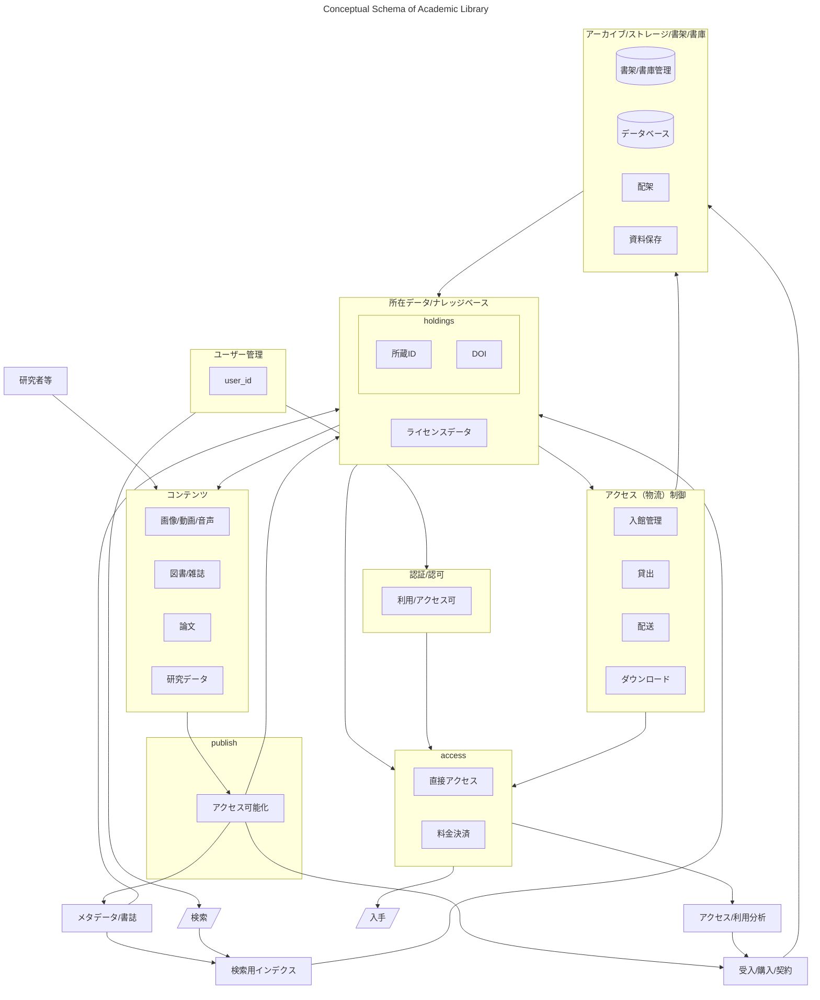

# 大学図書館の概念スキーマ

大学図書館を一つのデータベースと見立て、概念スキーマをER図風に書いてみた。

## 背景

- [オープンサイエンス時代における大学図書館の在り方について（審議のまとめ）令和５年１月２５日科学技術・学術審議会 情報委員会オープンサイエンス時代における大学図書館の在り方検討部会](https://www.mext.go.jp/content/20230325-mxt_jyohoka01-000028544.pdf.pdf)

> デジタル・ライブラリー」の実現には、大学図書館機能を物理的な「場」に制約されない形で再定義することが求められる。そのためには、「ライブラリー・スキーマ」を明確にした上で、利用者が何を求めているかを整理・再検討し、それを反映してデザインされた最適な環境を構築する必要がある。
> 教育・研究のＤＸが進展する中、今後の大学図書館には、物理的な「場」に制約されることなく大学図書館機能を再定義し、それに沿ってサービスを実現することが求められている。例えば、教育では「いつでも、どこでも、誰とでも」という教育や学習スタイルへの変容が想定されるが、その中で情報へのアクセスという観点から教員や学生がそれぞれどのような情報利用空間を必要とするかについての整理・再検討が必要となる。
> その前提として、様々な利用者に適した図書館のサービスをデザインするために必要な、自らの存在を規定する基本的な論理構造としての「ライブラリー・スキーマ」を明確にする必要がある。「ライブラリー・スキーマ」が実際にどのように見えるかは、研究あるいは教育の文脈、分野や立場（教員か学生かなど）によって異なっており、特に今後、仮想的な空間において大学図書館機能の実現を図る際には、その点に十分な留意が必要である。将来的には、利用者の立場ごとに異なる仮想空間（メタバース）を設けて、「ライブラリー・スキーマ」と接続することが想定される。

- [オープンサイエンス時代における大学図書館の在り方検討部会（第7回）議事録](https://www.mext.go.jp/b_menu/shingi/gijyutu/gijyutu29/004/gijiroku/mext_00007.html)

> 図書館について、ユーザービューが1つや2つじゃないですよね、教育・研究の現場は。それは学生のビューであるとともに、教える側のビューであり、また分野のいろんなビューがあって、それらを今までは1つの図書館機能として見せて実現してきたけど、デジタル化に伴って複数の顔を見せられるようになっています。そうはいうものの、図書館を主体としたときの論理構造は1つで、それが複数のビューに対応できるものになっていくのじゃないかというお話です。それぞれのビューが何で、対応の仕方がどうでというところまで至らないとのですが、もうちょっと具体的に言えるかもしれません。この点、私よりもベテランの図書館長の方々がいらっしゃいますので、教えていただければありがたいです。そうした中、コンテンツのデジタル化とネットワークのデジタル化というのとあって、どっちかというと後者のほうが見えにくいかもしれません。

>　いずれにしても、従来の図書館が建って本が並んでいて、司書さん・事務の方がいるという、そこだけでは済まなくなっていることは確かで、そうした構造を抽象化した論理構造（スキーマ）とともに、さらに上部にユーザービューに応じた論理構造（サブスキーマ）が入るんじゃないかなという気はしています。

>  今日においては、1つのシステムがベースにあるとしても、例えばインターフェースの部分というのが様々に変わっていくことによって、かなり個別的なシステム全体の利用、1人の人間から見たときのシステムの利便性と申しますか、利用の可能性というのは大きく変わっていく可能性が生まれているというのが今の世界なのではないかと思っています。ただ、そのときに、一人一人の人の様々なニーズに応えるからということでいろんなことを何も考えずにやってしまうと、多分システムはシステム全体としての合理性というものを全く追求できなくなってしまう可能性があって、そういった枠組みをきちんと決めるものがここで言うところのライブラリ・スキーマと言われるものなのではないか

> ライブラリ・スキーマという言葉、・・・(中略)・・・ モデルを構築してつくっていくものだというふうに認識しています。同時にこれは、図書館の現実とここでの議論をふまえて鍛えていくものでもありましょう。

>　ユーザービュー、あるいはサブスキーマ、そういうものが上にあって、下には人間と建物と本、そして情報処理装置からなる図書館の構造があって、その間に立つものとしてライブラリ・スキーマを設定する。どこまできれいにできるかというのは分からないですけど、まずはモデルとしてそういう3層構造として定義されるのじゃないか

## スキーマについて

　上記でいう **ライブラリー・スキーマ** は、文書中には明示されていないものの、「ビュー」という用語と共に語られていることを考え合わせると、データベース用語でいう概念スキーマのアナロジーと考えられる。もしくは、そう考えると理解しやすい。

- ウィキペディア [スキーマ (データベース)](https://ja.wikipedia.org/wiki/%E3%82%B9%E3%82%AD%E3%83%BC%E3%83%9E_(%E3%83%87%E3%83%BC%E3%82%BF%E3%83%99%E3%83%BC%E3%82%B9))
> スキーマ（schema）とは、データベースの構造であり、データベース管理システム (DBMS) でサポートされている形式言語で記述される。関係データベースでは、スキーマは関係 (表) と関係内の属性 (フィールド) 、属性や関係の関連の定義である。

> スキーマは一般にデータ辞書に格納される。スキーマはテキストによるデータベース言語のデータ定義言語 (DDL) で定義されるが、グラフィカルにデータベース構造を表したものをスキーマと呼ぶことも多い

> 三層スキーマ（Three schema approach）にはいくつかタイプがある。例えば概念-論理-物理の3つに分けるものや、外部-概念-内部の3つに分けるものがある。

> 概念スキーマ（英: Conceptual schema）とは、データベースに必要な情報をデータモデルによって抽象化し、その抽象化した概念と概念間の関係を定義した記述である。対象となる組織の意味論を説明し、その性質について一連の論理的表明を表す。特に、組織（実体クラス）の有意なものと、それに付随する情報、特性（属性）、それらのものの間の関連を説明する。

> 組織の意味論を表すものであってデータベース設計ではないため、その抽象レベルは様々である。ANSIの三層スキーマアーキテクチャでは、各利用者独自の観点を反映した概念スキーマを「外部スキーマ」と呼ぶ。逆にそれらを集約したものが「概念スキーマ」であるとされる。データモデルは各利用者の観点では固定的であり、それだけでは柔軟性に欠ける傾向がある。その個人の世界観が変われば、モデルも変更を余儀なくされる。概念スキーマはより抽象的で、本質的である。

- ［3層スキーマ 【three schema architecture】 ］(https://e-words.jp/w/3%E5%B1%A4%E3%82%B9%E3%82%AD%E3%83%BC%E3%83%9E.html)
> スキーマを外部-概念-内部の3階層で表現する著名なモデルに「ANSI/SPARC 3層スキーマ」がある。米国国家規格協会（ANSI）の標準化計画要求委員会（SPARC）が1975年に提唱した方式で、データの論理的および物理的な独立性の確保を主眼としている。

> 外部スキーマは利用者が必要とするデータの抜き出し方と並べ方を定義する。これはリレーショナルデータベース（RDB）ではビューなどに相当する。概念スキーマはデータ全体の論理的な構造を定義するもので、RDBではテーブルなどに相当する。内部スキーマは記憶装置やデータファイル上でのデータの配置や格納方法について定義する（RDBではRDBMSの内部仕様となる）。

## 大学図書館の論理構造

- 上述の「審議まとめ」において、以下のとおり書かれているとおり、大学図書館を一つの大きなデータベースとして考えてみた時に、そのデータベーススキーマを考えることができるのではないか、というのが本スキーマの発想である。

> 「デジタル・ライブラリー」においては、「一大学で完結する形で一つの図書館システムを整備する」という従来の前提にとらわれる必要はない。例えば、デジタルコンテンツを扱うプラットフォームの共有化、異なるプラットフォームの相互連携、コンテンツ利用契約の統合化、図書館システムの共同運用など「デジタル・ライブラリー」を実現するために大学間で連携して取り組むべき課題は多数存在する。その際、データセントリックな考え方に立って連携を構想することが重要である。

- 大学図書館を、そのデータの流れから考えると、アウトラインは以下のようになる、
  - 研究者等が作ったデータ・コンテンツを、アーカイブする
  - アーカイブしたコンテンツにメタデータを付与
  - メタデータを検索に渡すとともに、外部にも流通
  - ユーザは、メタデータを検索
  - ユーザの属性と、データ・コンテンツの属性にしたがって、データ・コンテンツを利用可能かどうか認証・認可
  - 認証・認可された内容にしたがってデータ・コンテンツを利用

- このアウトラインは抽象化したものであり、以下のように定義した
  - アーカイブ： 物理的に所蔵・配架すること、データとして保存されることを含み、場所も自館内もあれば、他館や、外部のストレージ、出版者が保存することなども含む
  - メタデータ： いわゆる書誌・目録の他、アーカイブから引き出すための所蔵・アクセス情報、ライセンス情報を含む。物理的に配架されている場合、禁帯出などもライセンス情報の一種
  - 認証・認可：　データ・コンテンツを要求する主体がどこの誰かを認証し、そのデータ・コンテンツはどういう属性の主体にはどういうアクセスが許可されているか、を判断する過程　

- これらは、これまでもあったリアルな図書館と、デジタルライブラリ、さらには仮想空間（メタバース）であっても、大学図書館を共通の構造として考えることが可能になった。

## 考察

　上記のように、改めて、大学図書館の論理構造を探ってみると、以下のように考えることができる。

- publish という機能を、コンテンツのアクセス可能化とそれに紐づくメタデータ管理、ライセンス管理、アクセス制御と捉えることができる。
  - アクセス可視化とは、著作権法にいう公表、送信可能化に加え、実際に公衆にアクセスが可能であることを周知する行為と捉える。
  - publish と、アーカイブ機能を、論理的には切り離すことができる。
  - 昔ながらの図書も、電子ジャーナル／ブックもリポジトリや研究データもデジタルアーカイブも共通に考えることができる。
  - これによって、研究データの publish、機関リポジトリによる研究成果のpublish も、本来的な大学図書館機能の一つである、と考えることができる。
  - 商業的出版者のみが担ってきた部分と、大学図書館の出版機能も共通に考えることができる。
  - 単なるアイデアではあるが、例えば、出版において、大学図書館は永続的なアーカイブとオンラインアクセスの提供を担い、それ以外の部分を商業的出版者が担う、というような機能分離も考えられないか。商業的出版者は、そのコストについて大学や著者からのコスト負担（支払い）を受けることも考えられ、あるいは紙媒体の販売など付加価値を付けた販売による収益を得ることなども考えられるのではないか。

- 大学図書館での資料提供という機能を、ユーザの認証・認可と、コンテンツ・データのライセンスとステイタス管理に基づくアクセス（物流）制御と、その結果による提供方法の選択、と捉える。
  - 所蔵に紐づくライセンスデータと、それを認証・認可に紐づけると、貸出とかアクセス管理になる。
  - 入館ゲートは入館資格の確認という **認証・認可** であり、それに基づいて、閲覧という資料への **アクセス（物流）制御** が行われている。
  - 閉架書庫に入庫できるか、などもまったく同様である。
  - オンラインにおいては、IPアドレス認証や、各種のID/パスワード認証により **認証・認可** が行われ、それに基づいて、オープンアクセスや各種の条件付き制限提供などを含む **アクセス（物流）制御** が行われている。

- 所在データとナレッジベース管理は、そのコンテンツ・データが、どこにかつどういう条件でアーカイブされているか、どこに行けば、どういう条件でアクセスできるか、という意味で共通の情報である。
  - 書架のどこにあるか、開架書架か閉架書庫か、貴重書庫か。
  - 海外のオープンなリポジトリにオープンアクセスとして提供されているのか、自館内にあるリポジトリにある提供条件のもと提供委されているのか、など。

- 大学図書館における検索を、書誌的メタデータから検索インデクスを作製し、その検索インデクスをユーザが検索、検索結果から、所在データ/ナレッジベースを手繰り寄せて、それによりライセンスにしたがってコンテンツ・データを入手する過程と捉える。
  - 書誌的メタデータは、コンテンツ・データの作成者が付与したものに、大学図書館が必要に応じ情報を付加したものである
    - 昔ながらの図書の場合、表題紙や奥付に作製者が付与したメタデータが記載されており、それをもとに大学図書館が目録を作っている
    - 商業出版者による電子ジャーナル、電子ブックの場合、作成者と出版者により検索インデクス自体が提供されている場合が多い
    - 研究データを自機関のリポジトリで提供する場合、研究者が付与したメタデータを基に大学図書館等がメタデータを作成する。
    - ライセンスデータについても上記と同様である。
  - 検索インデクスと、所蔵データ/ナレッジベース、ライセンスは、ID等によって連携されていれさえいれば、密結合している必要はない。

## その他の図書館的機能

- 「オープンサイエンス時代における大学図書館の在り方について（審議のまとめ）」では、以下のとおり述べられている。

> 修環境整備に関する既存業務のうち、主に大学図書館が担ってきた部分については、これまでの活動の評価を踏まえ、大学図書館が引き続き行うかどうか改めて整理する等、大学全体で検討する。

- ライブラリー・スキーマは、大学図書館を単館のみならず（単館に適用することも可能だが）大学図書館全体を一つのデータベースとして想定してみた場合の、概念スキーマである。
- そのデータベースをどう使ってもらうか、使い方をどう案内するか、使ってどういう成果を出すか、というのはスキーマの外部に規定される。 
- というよりは、通常データベースを作るとすれば、解決すべき課題があって、そのためにデータベースを作る。
- 従って、大学、あるいは学術コミュニティにとっての研究・教育を支援するために、大学図書館（というデータベース）が必要であり、そのための再設計をすること、がライブラリー・スキーマの設計であろう。
- 「審議のまとめ」に以下のとおり挙げられているような、研究者や学生のコンテンツ・データ作成支援、場所の提供、検索やICTのインストラクションを含むいわゆる情報リテラシーの提供なども、、必ずしも大学図書館の内部に抱え込まずに、ライブラリ・スキーマでそれぞれの機能を抽象化したように、大学の研究・教育を支援するための機能として抽象化し、再設計する必要があるだろう。
> 教材作成における著作物の利用を支援する体制の構築などに新たに取り組むことになる。その際、例えばラーニング・コモンズなど、これまで大学図書館が主導的な役割を果たしてきた学修環境整備

# License
The source code is licensed MIT. The website content is licensed CC BY 4.0,see LICENSE.
