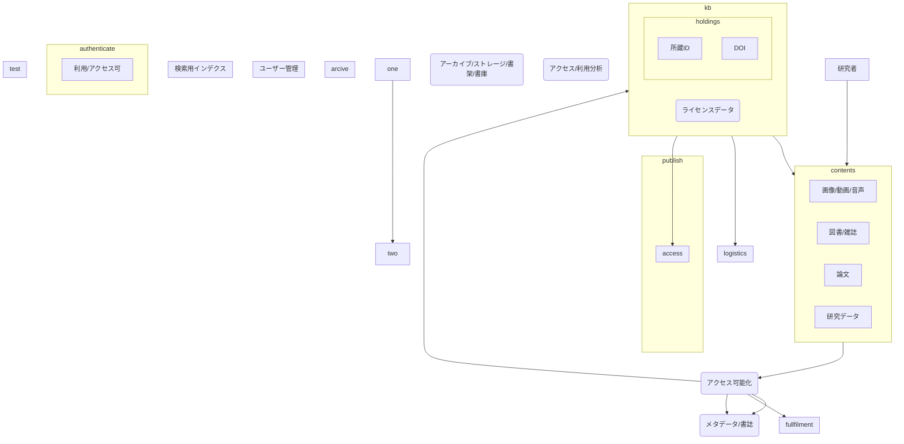

# 大学図書館の概念スキーマ

大学図書館を一つのデータベースと見立て、概念スキーマをER図風に書いてみた。

## 考察

- publishをコンテンツのアクセス可能化とそれに紐づくメタデータ管理、ライセンス管理、アクセス制御と捉えると、昔ながらの図書もEJもリポジトリや研究データもデジタルアーカイブも共通に考えられる。
- 所蔵に紐づくライセンスデータと、それを認証・認可に紐づけると、貸出とかアクセス管理になる

